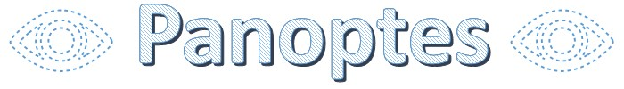

## What is Panoptes?

Panoptes is a cross-platform file watcher library for C++17 using std::filesystem and native interfaces. It is tested on Linux, Windows and macOS platforms with the help of the test framework Catch2. The main target is to unify the APIs of Windows, Linux and macOS. In an earlier stage Panoptes was a fork of [Axosoft nsfw](https://github.com/Axosoft/nsfw).

## What is supported?

Panoptes is observing all changes inside of a given directory. This includes add, modify or remove events. Even the changes inside of subdirectories (recursively) will be detected. Edge cases are covered too in case a file or directory will be moved in or out of the watched directory.

## Which native APIs are used by Panoptes?

* Windows: [ReadDirectoryChangesW](https://docs.microsoft.com/en-us/windows/win32/api/winbase/nf-winbase-readdirectorychangesw)
* macOS: [File System Events](https://developer.apple.com/documentation/coreservices/file_system_events)
* Linux: [inotify] (https://www.man7.org/linux/man-pages/man7/inotify.7.html)

## How to use it

1. Include Panoptes to your project.
2. Look into the small [console example](console/main.cpp) how to call and use the FileWatcher.

#### Conan
A conan package of the last release, can be created with the help of [conanfile.py](conan/conanfile.py).

## Wish list

#### Add rename/move support
Instead of detecting a rename/move event, Panoptes is detecting one add and one remove event. Under Linux in general and since Windows 10, it is possible to connect the add and remove event with each other to one rename/move event. But under MacOS (10.12) it seems to be not possible, because of the internal buffer system.

#### Direct return of the event in case it was detected
macOS buffers and stashes all detected events over a given time. This means that the callback of the native API is not returning immediately after a filesystem change happens. It waits for some time and then returns a batch of events. If the underlying filesystem is HFS+ (old filesystem of macOS) the buffering time has to be at least 1 second. To unify this experience Panoptes adds a buffer system to Linux and Windows, inspired by macOS. But it would be better if we find a way for macOS to return the results directly, instead of using for every platform a buffer system. With the new macOS filesystem APFS, it is possible to set the buffering time to some nanoseconds.

## More
* Issues and bugs can be raised on the [Issue tracker on GitHub](https://github.com/neXenio/panoptes/issues)
